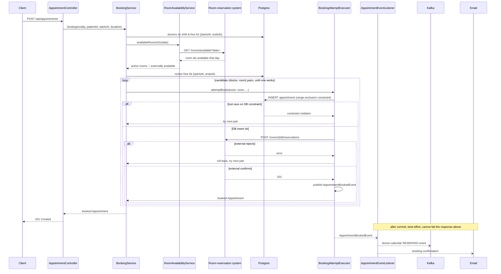

# Uphill Challenge — Appointments Service

Take-home solution for Uphill Health's developer challenge.

Built AI-assisted, deliberately — a 1-week scope rewards throughput, and
pairing with an AI let me spend that week on decisions instead of
typing. Every non-obvious call made along the way is logged in
[`DECISIONS.md`](./DECISIONS.md) as it happened, not written up after the
fact — worth a skim if you're curious how a given piece of this got the
shape it did, but not required reading to use or review the service
itself.

## Stack

| Concern | Choice |
|---|---|
| Language | Java 25 (LTS) |
| Framework | Spring Boot 4.0.7 |
| Build | Maven |
| Database | PostgreSQL |
| Migrations | Flyway |
| API docs | springdoc-openapi (Swagger UI) |
| Observability | OpenTelemetry |
| Room reservation | WireMock stub, synchronous — gates booking |
| Doctor-calendar sync | Apache Kafka — fire-and-forget event |
| Email | Spring Mail + GreenMail (fake SMTP) |
| Testing | JUnit 5, Mockito, Testcontainers (Postgres, Kafka), WireMock, GreenMail |
| Boilerplate | Lombok |

## System topology

```
   +------------+   HTTP    +--------------------------------+
   | Client /   | --------> |      appointments service       |
   |  Admin     |           |         (Spring Boot)           |
   +------------+           |                                  |
                             |  boundary/api -> control ->     |
                             |  boundary/external               |
                             +------+--------+---------+-------+
                                    |        |         |
                              JPA   |        |         | REST: GET/POST/DELETE
                                    v        |         v
                         +----------------+  |   +----------------------------+
                         |   PostgreSQL   |  |   |   Room-reservation system   |
                         +----------------+  |   |       (WireMock stub)       |
                                              |   |  synchronous, gates booking |
                                     send     |   +----------------------------+
                                    email     | produce
                                    v         v
                   +----------------------+  +----------------------------+
                   |     SMTP server      |  |    Doctor-calendar broker   |
                   |   (GreenMail fake)   |  |        (Apache Kafka)       |
                   |    fire-and-forget   |  |       fire-and-forget       |
                   +----------------------+  +----------------------------+

        (all boxes above also emit traces/metrics/logs to an
         OpenTelemetry collector - Grafana LGTM - not drawn here)
```

Everything except the app itself and Postgres is a stand-in for a real
external system — WireMock, Kafka, and GreenMail are all real infrastructure
(not in-process fakes), so the integration code is exercised the same way it
would be against the genuine services; only the endpoints they talk to are
local. See [`DECISIONS.md`](./DECISIONS.md) for why each one was modeled
that way (#006, #018, #021).

## Architecture at a glance

Package structure follows **Boundary-Control-Entity (BCE)**:

```
com.uphill.appointments
├── boundary/
│   ├── api/            inbound HTTP: REST controllers, DTOs, error handling
│   │   └── idempotency/  Idempotency-Key store for POST /api/appointments
│   ├── external/         outbound: room-reservation (RestClient) + doctor-calendar (Kafka) ports
│   ├── notification/       outbound: email confirmation
│   └── web/               server-rendered admin UI (htmx) — same BookingService/
│                          CancellationService as the REST API, in-process, no HTTP hop
├── control/            BookingService (allocation/retry, room-reservation gating),
│                       RoomAvailabilityService (external day-level room filter),
│                       CancellationService, lifecycle exceptions, after-commit fan-out
├── entity/             domain objects (Specialty, Doctor, Room, Patient, Appointment)
│   └── repository/       Spring Data JPA repositories
├── seed/               DevDataSeeder — profile-gated demo/dev fixture data (see Seeding data)
└── config/             cross-cutting infra config (OpenAPI docs) — outside the BCE triad,
                         not tied to a specific actor
```

- **Boundary** — anything touching an actor outside the system: inbound HTTP
  and outbound integrations (external systems, email).
- **Control** — use-case orchestration and business rules; mediates between
  Boundary and Entity, never does I/O directly.
- **Entity** — domain model + persistence.

**Booking flow:** `POST /api/appointments` takes a `date` + `offset`, an
optional explicit `startTime`, and an optional `durationMinutes` (defaults
to 30; 15-minute grid and multiples, 8-hour max, can't cross midnight). With
`startTime`, `BookingService.book` targets that exact instant. Without it,
`BookingService.bookOnDay` searches for a free doctor+room+time within
extended business hours (9am–6pm) instead — computing each candidate
doctor's and room's free time windows for the day and intersecting them
(`FreeWindowFinder`), rather than guessing individual instants; it fails
(409) if nothing fits in that window rather than silently booking outside
it. Both paths converge on the same candidate-list-plus-retry mechanism
(`BookingService`'s shared `tryBookCandidates`) described below.

`BookingService` (control) fetches doctors free at that range whose
per-day-of-week `DoctorSchedule` actually covers it (a doctor with no
schedule row for that day is off, not a candidate — doctors aren't
bookable "any time" the way rooms are), and asks `RoomAvailabilityService`
which rooms the external system reports available for that *day* before
even considering them as candidates — our own DB isn't a sufficient source
of truth for room availability on its own, since the external facilities
system may hold rooms for reasons we have no visibility into (maintenance,
other departments). That day-level check is a pre-filter, not the actual
gate: it narrows candidates before the retry loop starts, then the existing
overlap-aware DB check and `reserveRoom` call still do the real work of
avoiding a race between concurrent requests. `BookingService` tries to
persist an appointment for a candidate doctor+room pair. No-overbooking is
enforced by a database range-exclusion constraint over
`(doctor_id, [starts_at, ends_at))`, `(room_id, [starts_at, ends_at))`, and
`(patient_id, [starts_at, ends_at))` — a patient can't hold two overlapping
appointments any more than a doctor or room can double-book a slot. All
three are the same constraint shape for the same reason: appointments have
variable duration, so two candidates can overlap without sharing an exact
`starts_at`, which a plain unique index can't catch. The patient one has an
application-level fast path in front of it too — `book()` (explicit time)
checks it upfront and fails fast with a clear 409 rather than burning
retries on doctor/room candidates that were never going to help; `bookOnDay()`
folds it into the same free-window search as the doctor/room check, so a
patient busy for *part* of the day can still land a genuinely free slot
elsewhere in it. See DECISIONS.md #043. If a concurrent request wins the
race for a pair, the insert fails and the
service just tries the next pair. **Room reservation is part of that same
attempt**: a room must
actually be secured for the appointment to be valid, so
`BookingAttemptExecutor` calls the room-reservation system synchronously,
inside the same transaction as the DB insert — a rejection rolls the attempt
back and `BookingService` tries the next candidate pair, exactly like a lost
DB race. Once a booking commits, an `AppointmentBookedEvent` fires the
doctor-calendar update (published to Kafka, fire-and-forget — nothing in our
own correctness depends on it) and the confirmation email, both
best-effort, neither able to fail the already-successful booking response.



**Cancellation flow:** `POST /api/appointments/{id}/cancel?patientId=...` →
`CancellationService` marks the appointment `CANCELLED`. There's no login
anywhere in this API, so `patientId` is the only thing stopping someone who
merely learned or guessed an appointment's UUID from cancelling a stranger's
booking — it must match the `patientId` the appointment was booked under, or
the response is a plain 404 (not a distinct "forbidden," which would itself
leak that the UUID exists). The server-rendered admin UI's own cancel
button is exempt from this check — it's already behind HTTP Basic, so
`CancellationService` exposes a second, unchecked `cancel(UUID)` overload
just for that caller. See DECISIONS.md #041. Unlike reserving a
room, *releasing* it doesn't gate anything — the cancellation is already
correct the moment our own DB says so, so `AppointmentCancelledEvent` fires
the same kind of after-commit, best-effort fan-out as booking: release the
room (WireMock), release the doctor-calendar slot (Kafka), send a
cancellation email. A cancelled appointment's doctor/room/slot becomes
available again immediately (the no-overbooking range-exclusion constraint
is filtered to `status = 'BOOKED'`). "Reschedule" is just cancel + a fresh
booking call — no dedicated endpoint.

See [`DECISIONS.md`](./DECISIONS.md) for the reasoning behind every
non-obvious call (why a range-exclusion constraint instead of row locking,
why WireMock instead of an in-process fake, why an after-commit event instead of
a transactional outbox, and more) — read it alongside this README.

## Running locally

```bash
./mvnw spring-boot:run
```

Or, to build, start infra, and run seeded in one step:

```bash
make build-and-deploy-appointments
```

(`make up`/`make down`/`make logs`/`make build`/`make clean` are also
available individually - see the `Makefile`.)

Spring Boot's Docker Compose integration auto-starts everything the app needs
on boot (see `docker-compose.yaml`):

| Service | Purpose | Port |
|---|---|---|
| `postgres` | application database | random (auto-wired) |
| `wiremock` | stub room-reservation API | 8081 |
| `kafka` | doctor-calendar event broker | 9092 |
| `greenmail` | fake SMTP server for confirmation emails | 3025 (SMTP), 8082 (web UI) |
| `grafana-lgtm` | OpenTelemetry collector + dashboards | 3000 (UI), 4317/4318 (OTLP) |

Once running:
- Swagger UI: `http://localhost:8080/swagger-ui.html`
- Admin UI (server-rendered, no Swagger/curl needed):
  `http://localhost:8080/admin/appointments` — same `admin`/`admin` HTTP
  Basic credentials as the JSON admin listing endpoint (see DECISIONS.md
  #010/#035/#036). Browser will prompt once. Lists appointments (filter by
  specialty), books and cancels them through real forms backed by the same
  `BookingService`/`CancellationService` the REST API uses — a visual way
  to exercise the app without curl/Postman.
- Sent emails (GreenMail web UI): `http://localhost:8082` — by default
  (no profile, i.e. `./mvnw spring-boot:run` as above) confirmation/
  cancellation emails render as plain-text ASCII art; add the `prod`
  profile (`./mvnw spring-boot:run -Dspring-boot.run.profiles=prod`, or
  combine with `seed`: `-Dspring-boot.run.profiles=seed,prod`) to switch
  to the styled HTML templates instead — same `NotificationService`
  interface, swapped implementation, no other change needed.
- Grafana (traces/metrics/logs): `http://localhost:3000` (admin/admin) —
  Explore → Tempo for request traces (`service.name = appointments`,
  includes the auto-instrumented room-reservation HTTP call as a child
  span), Explore → Prometheus for business metrics
  (`appointments_booked_total`, `appointments_cancelled_total`,
  `appointments_booking_failed_total`), Explore → Loki for logs
  (`{service_name="appointments"}`) — each log line carries a `trace_id`
  label, so Tempo's "logs for this span" jump and Loki's derived-field link
  back to Tempo both work. Trace/span IDs also show up directly in console
  log lines once tracing is active — Boot's default correlation pattern, no
  config needed for that part.
- Logging is INFO by default (routine outcomes: bookings, cancellations,
  4xx client errors) with DEBUG-level tracing available for the fine-grained
  stuff (candidate attempts, best-effort dispatch confirmation) — add
  `--logging.level.com.uphill.appointments=DEBUG` to see it locally.
  Console output is a human-readable pattern by default; the `prod`
  profile (see above) switches it to structured JSON (Elastic Common
  Schema, one object per line) instead — same `traceId`/`spanId`
  correlation either way, just JSON fields instead of console text.
- Health check: `curl http://localhost:8080/actuator/health`

### Example request

```bash
curl -X POST http://localhost:8080/api/appointments \
  -H "Content-Type: application/json" \
  -H "Idempotency-Key: $(uuidgen)" \
  -d '{
    "patientId": "PAT-000001",
    "specialtyCode": "CARDIOLOGY",
    "date": "2026-08-20",
    "startTime": "09:30:00",
    "offset": "+00:00",
    "durationMinutes": 45
  }'
```

The patient must already exist — `patientId` is a business identifier, not
the database row id, and an unknown one returns 404. The resulting instant
(`date` + `startTime` + `offset`) must be in the future and align to a
15-minute grid; `durationMinutes` is optional (defaults to 30), must be a
15-minute multiple between 15 and 480 (8 hours), and can't push the
appointment past midnight. See **Seeding data** below for how to get
specialties/doctors/rooms/patients into a fresh database.

The `Idempotency-Key` header is optional but recommended: if a client never
sees the response (dropped connection, timeout) and retries with the same
key, it gets back the original response instead of risking a second
booking. Deliberately simplified — only successful bookings are replayed,
a reused key isn't checked against the request body, and the store is
in-memory (per-instance, 24h TTL). See DECISIONS.md #026.

Omit `startTime` to let the system pick a time itself, within extended
business hours (9am–6pm that day) — it searches for a free doctor+room+time
rather than requiring an exact instant, and fails (409) rather than
silently booking outside that window if nothing fits:

```bash
curl -X POST http://localhost:8080/api/appointments \
  -H "Content-Type: application/json" \
  -d '{
    "patientId": "PAT-000001",
    "specialtyCode": "CARDIOLOGY",
    "date": "2026-08-20",
    "offset": "+00:00",
    "durationMinutes": 45
  }'
```

The listing endpoint is the one route this API protects — see
**DECISIONS.md #010/#035** — HTTP Basic, `admin`/`admin` by default
(`spring.security.user.name`/`.password`):

```bash
curl -u admin:admin "http://localhost:8080/api/appointments?specialty=CARDIOLOGY&page=0&size=20"
```

Preview which rooms the external system reports as available on a given day,
before booking — `date` is a full `OffsetDateTime` (only the date component
is used), and a UTC (`Z`) offset is worth preferring over `+01:00` in a raw
curl command specifically: an un-encoded `+` in a query string means "space"
by the time the server decodes it, so `%2B01:00` or `--data-urlencode` would
be needed instead:

```bash
curl "http://localhost:8080/api/rooms/availability?date=2026-08-20T00:00:00Z"
```

Cancelling frees the doctor/room/slot immediately for rebooking —
`patientId` must match who it was booked under (see **Cancellation flow**
above; a mismatch or unknown id both come back 404):

```bash
curl -X POST "http://localhost:8080/api/appointments/{id}/cancel?patientId=PAT-000001"
```

## Seeding data

Flyway migrations are structure only (tables, constraints, indexes) — no
rows. A fresh database has no specialties, doctors, rooms, or patients until
you seed it:

```bash
./mvnw spring-boot:run -Dspring-boot.run.profiles=seed
```

This activates `DevDataSeeder` (`seed/DevDataSeeder.java`), which never runs
otherwise — default/production boot is completely unaffected. It's
idempotent (skips entirely if any specialty already exists), and populates:
the 4 real specialty codes (`CARDIOLOGY`, `DERMATOLOGY`, `GENERAL_PRACTICE`,
`PEDIATRICS`), a couple of doctors per specialty (each with a Monday–Friday
9am–6pm `DoctorSchedule`, weekends off), 5 rooms, and ~30 patients with
realistic mock demographics via [DataFaker](https://www.datafaker.net/)
(business ids `PAT-000001`, `PAT-000002`, ...). Check the app log or query
`GET /api/appointments` (`-u admin:admin`, see **Example request**) after
booking to find generated `patientId`s to test with.

## Running the tests

```bash
./mvnw verify
```

Unit and slice tests (`*Test.java`) run via Surefire in the `test` phase;
integration tests (`*IT.java`) run via Failsafe in the `verify` phase — so
`./mvnw verify` is the single command that runs everything. `./mvnw test`
alone runs the faster subset, skipping `BookingConcurrencyIT` and
`ExternalIntegrationIT` (still requires Docker for `AppointmentRepositoryTest`,
which uses Testcontainers Postgres despite the `Test` suffix).
`BookingConcurrencyIT` is the one worth reading first: it fires concurrent
booking requests at the same specialty/slot and asserts exactly as many
succeed as there is doctor capacity, which is the actual proof the
no-overbooking guarantee holds under real contention rather than just in a
single-threaded unit test.

## Load testing

```bash
docker compose up -d
./mvnw spring-boot:run -Dspring-boot.run.profiles=seed
# in a second terminal, once the app is up:
./mvnw gatling:test -Pload-test
```

Gatling, isolated behind a `load-test` Maven profile — `./mvnw verify`
(no flag) never resolves the Gatling dependencies or compiles the
simulation, since it lives under `src/load-test/java`, not `src/test/java`.
`BookingLoadSimulation` ramps to 40 requests/sec against
`POST /api/appointments`, spread across enough distinct specialty/date/time
combinations that seeded capacity isn't the limiting factor — the spec's
"thousands per day" is under 1 req/s sustained, so this is about proving
headroom and real latency, not just hitting the number. Results (including
an HTML report with the latency distribution) land under
`target/gatling/`. See DECISIONS.md #030 for why it's a separate source
root and what's deliberately out of scope (a contended-slot simulation,
left as a follow-up).

## Building the container

```bash
docker build -t uphill-appointments .
```

Multi-stage build on `eclipse-temurin:25-*`. The running container still needs
Postgres, the room-reservation system, a Kafka broker, and an SMTP endpoint
reachable — point `spring.datasource.*`, `app.integrations.room-reservation.base-url`,
`spring.kafka.bootstrap-servers`, and `spring.mail.*` at your target environment.

## Notes, Business Assumptions, Gaps & Next Steps

### Niceties

- **A full test pyramid, not just "the tests pass."** Unit tests (Mockito,
  no Spring context), slice tests (`@DataJpaTest`/`@WebMvcTest` against a
  real Testcontainers Postgres), integration tests (real WireMock, real
  Kafka broker, real GreenMail SMTP), and Gatling load tests — each proving
  a different kind of correctness, from pure logic up to sustained
  throughput.
- **Went beyond the base spec in a few deliberate places** — variable-
  duration appointments, day-only search, patient-overlap protection,
  request idempotency, a server-rendered admin UI. Every one of those is
  argued for (and against) in `DECISIONS.md`, not just present.
- **Concurrency is a first-class concern, not an afterthought.**
  No-overbooking is enforced by database range-exclusion constraints, not
  application-level locking, and `BookingConcurrencyIT` proves the
  guarantee holds under real concurrent requests — not just in a
  single-threaded unit test.
- **Strong local development support.** `docker-compose` stands up every
  dependency this service talks to — Postgres, WireMock, Kafka, GreenMail —
  as real infrastructure, not in-process fakes, so the code path exercised
  locally is the same one that would run against the genuine external
  systems.
- **Observability wired end-to-end in the local environment**, not just
  configured and hoped for — traces (Tempo), logs (Loki), and metrics
  (Prometheus/Mimir) all flow through Grafana LGTM, verified live rather
  than assumed to work.

### Business Assumptions

- A patient can't hold two overlapping appointments, the same guarantee —
  and the same mechanism — as a doctor or room not being double-booked
  (see `DECISIONS.md` #043).
- Appointment slots are grid-aligned to 15-minute increments — a business
  decision about how scheduling should feel, not a technical constraint.
- Doctors have defined working days and hours (`DoctorSchedule`); a doctor
  with no schedule row for a given day is simply off, not "bookable any
  time."
- Business hours (9am–6pm) and the working week are fixed defaults for
  this scope — not yet configurable per doctor or per facility (see Gaps
  below).

### Gaps & Next Steps

- **Working-hours modeling is intentionally shallow.** No lunch breaks, no
  buffer time between back-to-back appointments, no per-doctor variation
  beyond a single daily range. A real system needs a richer schedule model
  than "one range per day of the week."
- **This service currently owns business data it shouldn't.** Specialties,
  staff, staff availability, and patient records are reference data a real
  Uphill Health would own in dedicated upstream services — this service's
  only real job should be making appointments, consuming that data rather
  than inventing it locally.
- That misplaced ownership is also *why* the admin listing needed a
  fetch-join workaround for its N+1 in the first place — once
  specialty/doctor/room/patient come from external services instead of
  local joins, the whole shape of that problem changes (and likely gets
  simpler, not harder).
- **Timezone handling is "whatever offset the caller sends."** No
  per-facility timezone concept, no explicit handling of DST-transition
  edge cases.
- **No concept of facilities** (hospitals, clinics, units) — rooms and
  doctors are global rather than scoped to a location, and booking rules
  (business hours, slot granularity) are hardcoded rather than driven by
  facility-specific configuration.
- No CI/CD pipeline wired up yet.
- **Local Kubernetes development story is unfinished** — started sketching
  manifests with Kustomize; would like to layer Tilt on top for a proper
  local-cluster inner loop rather than relying on docker-compose alone.
- **Auth is HTTP Basic with hardcoded credentials** — fine for a take-home,
  not for anything real. Would want a proper IAM (Keycloak or similar) in
  front of this, with machine-to-machine tokens for service-to-service
  calls once this stops being a single monolith.
- **Post-booking side effects are best-effort, fire-and-forget, with no
  durable retry** (see `DECISIONS.md` #007) — acceptable at this scope,
  but today a lost Kafka publish or a failed email is just a log line, not
  a retried delivery.
- **Event payloads have no schema/contract enforcement** (Avro, JSON
  Schema, or similar) — a producer/consumer mismatch would only surface at
  runtime right now.
- A transactional outbox for the event-publishing path is probably
  overkill at this scope, but it's the correct next step up from the
  current after-commit-listener approach once durable delivery actually
  matters.
- Would like an `AGENTS.md` for this repo — the conventions and context an
  AI coding agent (or a new teammate) needs to work in this codebase
  productively, distinct from this human-facing README.

