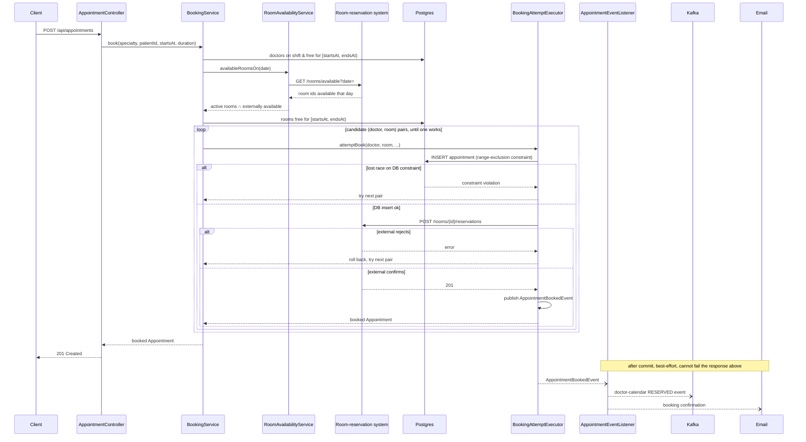

# Uphill Challenge — Appointments Service

Take-home solution for Uphill Health's Senior Developer challenge: a Spring
Boot service that schedules medical appointments in Portugal. The patient
picks a specialty and a timeslot; the system auto-assigns an available doctor
and room, guarantees no doctor or room is ever double-booked, and confirms the
booking to the patient by email — while updating the doctor's calendar and
reserving the room in (stubbed) external systems. Appointments can also be
cancelled, freeing the doctor/room/slot for rebooking, with a symmetric
release fan-out to the same external systems.

## Stack

| Concern | Choice |
|---|---|
| Language | Java 25 (LTS) |
| Framework | Spring Boot 4.0.7 |
| Build | Maven |
| Database | PostgreSQL |
| Migrations | Flyway |
| API docs | springdoc-openapi (Swagger UI) |
| Observability | OpenTelemetry |
| Room reservation | WireMock stub, synchronous — gates booking |
| Doctor-calendar sync | Apache Kafka — fire-and-forget event |
| Email | Spring Mail + GreenMail (fake SMTP) |
| Testing | JUnit 5, Mockito, Testcontainers (Postgres, Kafka), WireMock, GreenMail |
| Boilerplate | Lombok |

## System topology

```
   +------------+   HTTP    +--------------------------------+
   | Client /   | --------> |      appointments service       |
   |  Admin     |           |         (Spring Boot)           |
   +------------+           |                                  |
                             |  boundary/api -> control ->     |
                             |  boundary/external               |
                             +------+--------+---------+-------+
                                    |        |         |
                              JPA   |        |         | REST: GET/POST/DELETE
                                    v        |         v
                         +----------------+  |   +----------------------------+
                         |   PostgreSQL   |  |   |   Room-reservation system   |
                         +----------------+  |   |       (WireMock stub)       |
                                              |   |  synchronous, gates booking |
                                     send     |   +----------------------------+
                                    email     | produce
                                    v         v
                   +----------------------+  +----------------------------+
                   |     SMTP server      |  |    Doctor-calendar broker   |
                   |   (GreenMail fake)   |  |        (Apache Kafka)       |
                   |    fire-and-forget   |  |       fire-and-forget       |
                   +----------------------+  +----------------------------+

        (all boxes above also emit traces/metrics/logs to an
         OpenTelemetry collector - Grafana LGTM - not drawn here)
```

Everything except the app itself and Postgres is a stand-in for a real
external system — WireMock, Kafka, and GreenMail are all real infrastructure
(not in-process fakes), so the integration code is exercised the same way it
would be against the genuine services; only the endpoints they talk to are
local. See [`DECISIONS.md`](./DECISIONS.md) for why each one was modeled
that way (#006, #018, #021).

## Architecture at a glance

Package structure follows **Boundary-Control-Entity (BCE)**:

```
com.uphill.appointments
├── boundary/
│   ├── api/            inbound HTTP: REST controller, DTOs, error handling
│   ├── external/         outbound: room-reservation (RestClient) + doctor-calendar (Kafka) ports
│   └── notification/       outbound: email confirmation
├── control/            BookingService (allocation/retry, room-reservation gating),
│                       RoomAvailabilityService (external day-level room filter),
│                       CancellationService, lifecycle exceptions, after-commit fan-out
├── entity/             domain objects (Specialty, Doctor, Room, Patient, Appointment)
│   └── repository/       Spring Data JPA repositories
└── config/             cross-cutting infra config (OpenAPI docs) — outside the BCE triad,
                         not tied to a specific actor
```

- **Boundary** — anything touching an actor outside the system: inbound HTTP
  and outbound integrations (external systems, email).
- **Control** — use-case orchestration and business rules; mediates between
  Boundary and Entity, never does I/O directly.
- **Entity** — domain model + persistence.

**Booking flow:** `POST /api/appointments` takes a `date` + `offset`, an
optional explicit `startTime`, and an optional `durationMinutes` (defaults
to 30; 15-minute grid and multiples, 8-hour max, can't cross midnight). With
`startTime`, `BookingService.book` targets that exact instant. Without it,
`BookingService.bookOnDay` searches for a free doctor+room+time within
extended business hours (9am–6pm) instead — computing each candidate
doctor's and room's free time windows for the day and intersecting them
(`FreeWindowFinder`), rather than guessing individual instants; it fails
(409) if nothing fits in that window rather than silently booking outside
it. Both paths converge on the same candidate-list-plus-retry mechanism
(`BookingService`'s shared `tryBookCandidates`) described below.

`BookingService` (control) fetches doctors free at that range whose
per-day-of-week `DoctorSchedule` actually covers it (a doctor with no
schedule row for that day is off, not a candidate — doctors aren't
bookable "any time" the way rooms are), and asks `RoomAvailabilityService`
which rooms the external system reports available for that *day* before
even considering them as candidates — our own DB isn't a sufficient source
of truth for room availability on its own, since the external facilities
system may hold rooms for reasons we have no visibility into (maintenance,
other departments). That day-level check is a pre-filter, not the actual
gate: it narrows candidates before the retry loop starts, then the existing
overlap-aware DB check and `reserveRoom` call still do the real work of
avoiding a race between concurrent requests. `BookingService` tries to
persist an appointment for a candidate doctor+room pair. No-overbooking is
enforced by a database range-exclusion constraint over
`(doctor_id, [starts_at, ends_at))` and `(room_id, [starts_at, ends_at))` —
appointments have variable duration, so two candidates can overlap without
sharing an exact `starts_at`, which a plain unique index can't catch. If a
concurrent request wins the race for a pair, the insert fails and the
service just tries the next pair. **Room reservation is part of that same
attempt**: a room must
actually be secured for the appointment to be valid, so
`BookingAttemptExecutor` calls the room-reservation system synchronously,
inside the same transaction as the DB insert — a rejection rolls the attempt
back and `BookingService` tries the next candidate pair, exactly like a lost
DB race. Once a booking commits, an `AppointmentBookedEvent` fires the
doctor-calendar update (published to Kafka, fire-and-forget — nothing in our
own correctness depends on it) and the confirmation email, both
best-effort, neither able to fail the already-successful booking response.



**Cancellation flow:** `POST /api/appointments/{id}/cancel` →
`CancellationService` marks the appointment `CANCELLED`. Unlike reserving a
room, *releasing* it doesn't gate anything — the cancellation is already
correct the moment our own DB says so, so `AppointmentCancelledEvent` fires
the same kind of after-commit, best-effort fan-out as booking: release the
room (WireMock), release the doctor-calendar slot (Kafka), send a
cancellation email. A cancelled appointment's doctor/room/slot becomes
available again immediately (the no-overbooking indexes are partial,
filtered to `status = 'BOOKED'`). "Reschedule" is just cancel + a fresh
booking call — no dedicated endpoint.

See [`DECISIONS.md`](./DECISIONS.md) for the reasoning behind every
non-obvious call (why a unique constraint instead of row locking, why
WireMock instead of an in-process fake, why an after-commit event instead of
a transactional outbox, and more) — read it alongside this README.

## Running locally

```bash
./mvnw spring-boot:run
```

Spring Boot's Docker Compose integration auto-starts everything the app needs
on boot (see `docker-compose.yaml`):

| Service | Purpose | Port |
|---|---|---|
| `postgres` | application database | random (auto-wired) |
| `wiremock` | stub room-reservation API | 8081 |
| `kafka` | doctor-calendar event broker | 9092 |
| `greenmail` | fake SMTP server for confirmation emails | 3025 (SMTP), 8082 (web UI) |
| `grafana-lgtm` | OpenTelemetry collector + dashboards | 3000 |

Once running:
- Swagger UI: `http://localhost:8080/swagger-ui.html`
- Sent emails (GreenMail web UI): `http://localhost:8082`

### Example request

```bash
curl -X POST http://localhost:8080/api/appointments \
  -H "Content-Type: application/json" \
  -H "Idempotency-Key: $(uuidgen)" \
  -d '{
    "patientId": "PAT-0001",
    "specialtyCode": "CARDIOLOGY",
    "date": "2026-08-20",
    "startTime": "09:30:00",
    "offset": "+00:00",
    "durationMinutes": 45
  }'
```

The patient must already exist — `patientId` is a business identifier, not
the database row id, and an unknown one returns 404. The resulting instant
(`date` + `startTime` + `offset`) must be in the future and align to a
15-minute grid; `durationMinutes` is optional (defaults to 30), must be a
15-minute multiple between 15 and 480 (8 hours), and can't push the
appointment past midnight. See **Seeding data** below for how to get
specialties/doctors/rooms/patients into a fresh database.

The `Idempotency-Key` header is optional but recommended: if a client never
sees the response (dropped connection, timeout) and retries with the same
key, it gets back the original response instead of risking a second
booking. Deliberately simplified — only successful bookings are replayed,
a reused key isn't checked against the request body, and the store is
in-memory (per-instance, 24h TTL). See DECISIONS.md #026.

Omit `startTime` to let the system pick a time itself, within extended
business hours (9am–6pm that day) — it searches for a free doctor+room+time
rather than requiring an exact instant, and fails (409) rather than
silently booking outside that window if nothing fits:

```bash
curl -X POST http://localhost:8080/api/appointments \
  -H "Content-Type: application/json" \
  -d '{
    "patientId": "PAT-0001",
    "specialtyCode": "CARDIOLOGY",
    "date": "2026-08-20",
    "offset": "+00:00",
    "durationMinutes": 45
  }'
```

```bash
curl "http://localhost:8080/api/appointments?specialty=CARDIOLOGY&page=0&size=20"
```

Preview which rooms the external system reports as available on a given day,
before booking:

```bash
curl "http://localhost:8080/api/rooms/availability?date=2026-08-20"
```

Cancelling frees the doctor/room/slot immediately for rebooking:

```bash
curl -X POST http://localhost:8080/api/appointments/{id}/cancel
```

## Seeding data

Flyway migrations are structure only (tables, constraints, indexes) — no
rows. A fresh database has no specialties, doctors, rooms, or patients until
you seed it:

```bash
./mvnw spring-boot:run -Dspring-boot.run.profiles=seed
```

This activates `DevDataSeeder` (`seed/DevDataSeeder.java`), which never runs
otherwise — default/production boot is completely unaffected. It's
idempotent (skips entirely if any specialty already exists), and populates:
the 4 real specialty codes (`CARDIOLOGY`, `DERMATOLOGY`, `GENERAL_PRACTICE`,
`PEDIATRICS`), a couple of doctors per specialty (each with a Monday–Friday
9am–6pm `DoctorSchedule`, weekends off), 5 rooms, and ~30 patients with
realistic mock demographics via [DataFaker](https://www.datafaker.net/)
(business ids `PAT-000001`, `PAT-000002`, ...). Check the app log or query
`GET /api/appointments` after booking to find generated `patientId`s to test
with.

## Running the tests

```bash
./mvnw verify
```

Unit and slice tests (`*Test.java`) run via Surefire in the `test` phase;
integration tests (`*IT.java`) run via Failsafe in the `verify` phase — so
`./mvnw verify` is the single command that runs everything. `./mvnw test`
alone runs the faster subset, skipping `BookingConcurrencyIT` and
`ExternalIntegrationIT` (still requires Docker for `AppointmentRepositoryTest`,
which uses Testcontainers Postgres despite the `Test` suffix).
`BookingConcurrencyIT` is the one worth reading first: it fires concurrent
booking requests at the same specialty/slot and asserts exactly as many
succeed as there is doctor capacity, which is the actual proof the
no-overbooking guarantee holds under real contention rather than just in a
single-threaded unit test.

## Building the container

```bash
docker build -t uphill-appointments .
```

Multi-stage build on `eclipse-temurin:25-*`. The running container still needs
Postgres, the room-reservation system, a Kafka broker, and an SMTP endpoint
reachable — point `spring.datasource.*`, `app.integrations.room-reservation.base-url`,
`spring.kafka.bootstrap-servers`, and `spring.mail.*` at your target environment.

## Known gaps / what's next

- **No auth** on the admin listing endpoint — out of scope per the spec, but
  the first thing to add before any real traffic. See DECISIONS.md #010.
- **No durable retry** if a best-effort post-action fails — doctor-calendar
  Kafka publish, confirmation/cancellation email, or room release on cancel —
  logged, not retried. A transactional outbox would close this; deliberately
  not built for a one-week scope. See DECISIONS.md #007. (Room *reservation*
  during booking is different: it gates the booking attempt itself, so a
  failure there doesn't need durable retry — the candidate pair just doesn't
  become a booking. See DECISIONS.md #018, #020.)
- **Appointments can't cross midnight** — a doctor's schedule is a single
  per-day-of-week range, so a request whose computed `endsAt` falls on a
  different calendar date than `startsAt` is rejected. See DECISIONS.md #024.
- **Day-only "today" window-start rule has no deterministic unit test** —
  covered by live smoke testing instead; a proper test would need a `Clock`
  injected into `BookingService`, not introduced since nothing else needs
  one. See DECISIONS.md #025.
- **No patient-provisioning API** — patients only come from the `seed`
  profile's `DevDataSeeder` (see **Seeding data**) or direct DB access;
  there's no registration endpoint. Booking requires a `patientId` to
  already exist. See DECISIONS.md #016, #017.
- **Booking now has two required external round trips** (day-level
  availability check, then per-candidate reservation) instead of one — both
  are synchronous and both can fail the booking (409 on rejection, 503 if
  the availability check itself can't be reached from the preview endpoint).
  See DECISIONS.md #021.
- **In-memory-only caching/dedup**: the room-availability cache and the
  idempotency-key store are both plain in-memory maps — correct for a
  single instance, but wouldn't dedupe across a multi-instance deployment.
  A shared store (Redis, or the DB) would be needed there. See
  DECISIONS.md #026.
